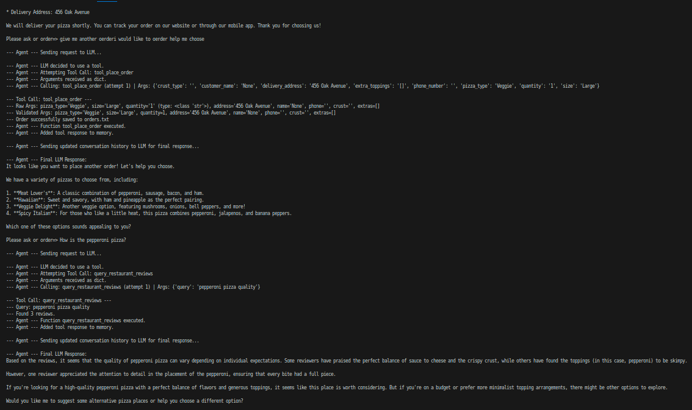

# LocalAIAgentWithRAGAndToolCall

A local AI agent with Retrieval-Augmented Generation (RAG) and Tool Call capabilities for managing a pizza restaurant's orders and customer reviews. The agent uses Ollama for local LLM inference and ChromaDB for vector storage.



## Features

- 🔍 **Smart Review Search**: Query restaurant reviews using natural language
- 🍕 **Order Management**: Place pizza orders with customizable options
- 💾 **Local Processing**: All operations run locally using Ollama
- 📊 **Vector Database**: Efficient review storage and retrieval using ChromaDB
- 🤖 **Contextual Memory**: Agent maintains conversation history for better responses

## Prerequisites

- Python 3.8+
- Ollama installed locally with required models:
  - llama2 (for chat interactions)
  - mxbai-embed-large (for embeddings)
- Required Python packages (see requirements.txt)

## Setup

1. Clone the repository:

```bash
git clone https://github.com/patrickwide/LocalAIAgentWithRAGAndToolCall.git
cd LocalAIAgentWithRAGAndToolCall
```

2. Create and activate a virtual environment:

```bash
python -m venv venv
source venv/bin/activate  # On Windows: venv\Scripts\activate
```

3. Install dependencies:

```bash
pip install -r requirements.txt
```

4. Make sure Ollama is running with the required models:

```bash
ollama pull llama3.2
ollama pull mxbai-embed-large
```

## Usage

1. Run the restaurant agent:

```bash
python restaurant_agent.py
```

2. Interact with the agent:

- Query reviews: "How is the pepperoni pizza?"
- Place orders: "I want to order 1 large veggie pizza to 456 Oak Avenue"
- Ask about services: "Tell me about the service quality"
- Type "exit" to quit

## Project Structure

- `restaurant_agent.py`: Main agent implementation
- `realistic_restaurant_reviews.csv`: Sample restaurant reviews data
- `chrome_langchain_db_reviews/`: Vector database storage
- `requirements.txt`: Project dependencies

## Example Interactions

```
Ask about reviews or place an order.
Please ask or order=> How is the pepperoni pizza?
[Agent will search reviews and provide relevant feedback]

Please ask or order=> I want to order a large pepperoni pizza
[Agent will guide you through the order process]
```

## License

MIT License
